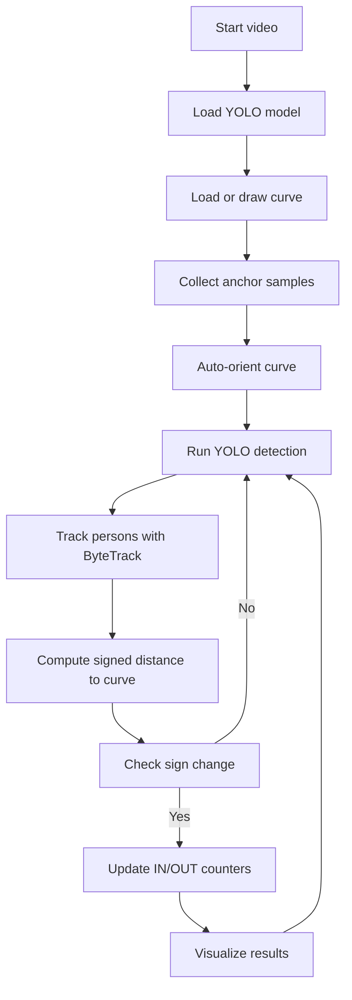

# 🧠 Person Counter — Curve-Based IN/OUT Detection

## Overview

This module performs **bi-directional people counting** using a **custom curve** and object tracking.
It detects when tracked persons **cross a user-defined boundary curve**, automatically determines curve orientation, and updates **IN** / **OUT** counts accordingly.

It combines:

* **YOLOv8 object detection** (for person detection)
* **ByteTrack multi-object tracking**
* **Geometric curve-crossing logic**
* **Auto-orientation detection** to adapt to different camera setups

---

## 🎯 Key Features

### 1. Custom Curve Boundary

* The user defines a **curve** across the scene (using mouse clicks).
* The curve is saved in `config/curve_config.json`.
* This curve represents the **virtual counting line** between "inside" and "outside" regions.

### 2. Automatic Curve Orientation

* The system automatically infers which side of the curve represents **IN** or **OUT**.
* It collects a few sample person trajectories during the first frames.
* Then it determines the **dominant crossing direction** to establish orientation.
* This removes the need for manual configuration (e.g., “swap IN/OUT sides”).

### 3. Tracking-Based Counting

* The YOLO model detects persons.
* ByteTrack assigns **unique IDs** to maintain identity across frames.
* For each tracked ID:

  * The **anchor point** (bottom-center of the bounding box) is evaluated against the curve.
  * The system computes a **signed distance** to the curve.
  * When the **sign changes**, the person has crossed the boundary → triggers IN or OUT count.

### 4. State Management

Each track ID maintains:

```python
{
    'last_sign': None,
    'counted': False
}
```

This ensures each person is counted **exactly once per crossing**.

### 5. Real-Time Visualization

* The live feed displays:

  * The curve (yellow polyline)
  * Bounding boxes (cyan, turning green once counted)
  * On-screen counters for **IN** and **OUT**

---

## ⚙️ Workflow Overview



---

## 📐 Geometry Explained

### Signed Distance

The **signed distance** determines whether a point lies above or below the curve:

* **Positive** → below the curve (e.g. "outside")
* **Negative** → above the curve (e.g. "inside")

This is computed by projecting the person’s anchor point onto the nearest curve segment and using the **2D cross product** to assign the sign.

### Orientation Correction

The **auto-orientation detector** evaluates the initial few crossings:

* If the mean direction of crossing is **positive**, orientation = `+1`
* Otherwise, orientation = `-1`

This multiplier is applied to all signed distances, ensuring IN/OUT direction consistency regardless of how the curve was drawn.

---

## 🧩 Code Structure

```
├── main.py                   # Main tracking and counting loop
├── modules/
│   ├── tracker_logic.py      # State updates and counting
│   ├── curve_utils.py        # Curve drawing, loading, and saving
├── config/
│   └── curve_config.json     # Saved curve coordinates
├── data/
│   ├── videos/               # Source video files
│   └── test_trajectory.csv   # Offline test trajectories
```

---

## 🧮 Counting Logic (Simplified)

```python
for anchor in trajectory:
    dist_signed = signed_distance_to_curve(anchor, curve)
    current_sign = np.sign(dist_signed * orientation)

    if last_sign is not None and not counted:
        if last_sign > 0 and current_sign < 0:
            in_count += 1
            counted = True
        elif last_sign < 0 and current_sign > 0:
            out_count += 1
            counted = True

    last_sign = current_sign
```

---

## 📊 Output Example

**Console output:**

```
Auto-detected curve orientation: +1
Final IN Count: 8
Final OUT Count: 6
```

**On-screen display:**

* `IN: 8` (green)
* `OUT: 6` (red)
* Tracked boxes with IDs and colored status

---

## 🧠 Future Enhancements

| Feature                           | Description                                                             | Status     |
| --------------------------------- | ----------------------------------------------------------------------- | ---------- |
| **Gray-zone hysteresis**          | Stabilize counts near the curve to reduce flickering sign changes       | 🕐 Parked  |
| **Dynamic camera flip detection** | Detect if the camera orientation changes significantly during operation | 🕐 Parked  |
| **Orientation smoothing**         | Re-evaluate auto-orientation periodically in long videos                | 🕐 Planned |

---

## 🧰 Dependencies

| Library          | Purpose                          |
| ---------------- | -------------------------------- |
| `opencv-python`  | Frame processing & visualization |
| `numpy`          | Geometry & math                  |
| `ultralytics`    | YOLO detection                   |
| `cvzone`         | Easy on-screen overlays          |
| `bytetrack.yaml` | Multi-object tracking            |

---

## 🚀 Running the System

1. Place your input video in `data/videos/`
2. Run:

   ```bash
   python main.py
   ```
3. If no curve config exists, draw one on the first frame using your mouse.
4. The system will:

   * Detect people
   * Auto-determine curve orientation
   * Start counting IN and OUT crossings in real time
